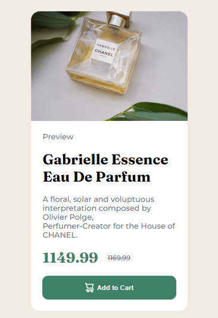

# Frontend Mentor - Product preview card component solution

This is a solution to the [Product preview card component challenge on Frontend Mentor](https://www.frontendmentor.io/challenges/product-preview-card-component-GO7UmttRfa). Frontend Mentor challenges help you improve your coding skills by building realistic projects. 

## Table of contents

- [Overview](#overview)
  - [The challenge](#the-challenge)
  - [Screenshot](#screenshot)
  - [Links](#links)
- [My process](#my-process)
  - [Built with](#built-with)
  - [What I learned](#what-i-learned)
  - [Continued development](#continued-development)
  - [Useful resources](#useful-resources)
- [Author](#author)
- [Acknowledgments](#acknowledgments)

**Note: Delete this note and update the table of contents based on what sections you keep.**

## Overview

### The challenge // Desafio

Your challenge is to build out this product preview card component and get it looking as close to the design as possible.
You can use any tools you like to help you complete the challenge. So if you've got something you'd like to practice, feel free to give it a go.

Users should be able to:

- View the optimal layout depending on their device's screen size
- See hover and focus states for interactive elements

// ESPAÑOL //

El reto consiste en crear este componente de tarjeta de vista previa del producto y conseguir que se parezca lo máximo posible al diseño.
Puedes utilizar las herramientas que quieras para completar el reto. Así que si tienes algo que te gustaría practicar, no dudes en intentarlo.

Tus usuarios deben ser capaces de:

Ver el diseño óptimo en función del tamaño de pantalla de su dispositivo.
Ver los estados "hover" y "focus" de los elementos interactivos

### Screenshot

These are the screenshots of the different styles for Mobile and Desktop

// ESPAÑOL //
Estas son las capturas de los diferentes estilos para Mobile y Desktop

 - Mobile
 - Desktop

### Links

- Solution URL: [Add solution URL here](https://your-solution-url.com)
- Live Site URL: [Add live site URL here](https://your-live-site-url.com)

## My process

### Built with

- Semantic HTML5 markup
- CSS custom properties
- Flexbox
- Mobile-first workflow
- Sass

### What I learned

By completing the challenge, I learned how to use Flexbox to create flexible and responsive layouts in my web projects. I found that Flexbox is a powerful tool for laying out elements in a container, allowing me to create complex and adaptable layouts with ease.

Also, I learned how to use CSS to style my web pages. I discovered how to use CSS properties to control the presentation and layout of elements on a web page. Also, I learned how to use Sass to improve my workflow and optimize my CSS code. I loved the ability to create variables, functions, rule nesting, and other advanced features in my CSS code with Sass.

In short, this challenge allowed me to gain valuable skills for my career as a web developer, which will allow me to create beautiful and effective web pages for my clients in the future.

// ESPAÑOL //

l completar el desafío, aprendí cómo utilizar Flexbox para crear diseños flexibles y responsivos en mis proyectos web. Me di cuenta de que Flexbox es una herramienta poderosa para distribuir elementos en un contenedor, lo que me permite crear diseños complejos y adaptables con facilidad.

Además, aprendí cómo utilizar CSS para dar estilo a mis páginas web. Descubrí cómo utilizar las propiedades CSS para controlar la presentación y el diseño de los elementos en una página web. Además, aprendí cómo utilizar Sass para mejorar mi flujo de trabajo y optimizar mi código CSS. Me encantó la capacidad de crear variables, funciones, anidación de reglas y otras características avanzadas en mi código CSS con Sass.

En resumen, este desafío me permitió adquirir habilidades valiosas para mi carrera de desarrollador web, lo que me permitirá crear páginas web hermosas y efectivas para mis clientes en el futuro.

## Author

- Frontend Mentor - [@yourusername](https://www.frontendmentor.io/profile/yourusername)
- GitHub - [@rken2010](https://github.com/rken2010)

